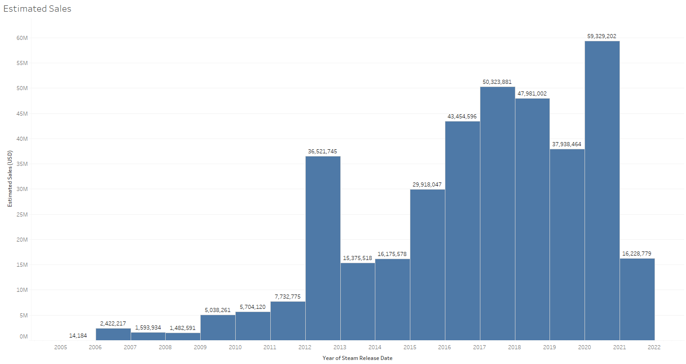
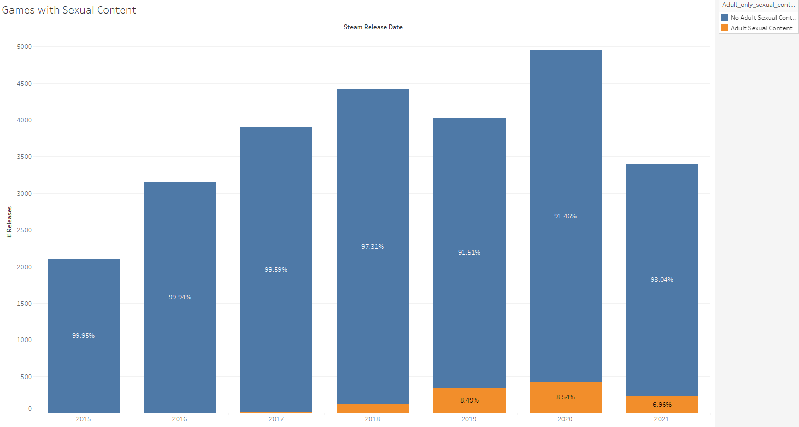

# Steam-Data-Analysis

## Introduction

Steam has been the household name for Digital PC gaming since its release. Before then it was CDs, and these were distributed by various physical shops. Today's world is different. And hand in hand with digital often comes Monopoly. And Steam is no expcetion - it has few successful competitors, and those that have been a threat to its hegemony have done so at great cost. Epic Games Store is one such, having attracted many publishers through paid timed exclusives and taking lower cuts on sales. The only other storefronts of note are Humble Bundle and GOG, both with particular niche selling points. The former sells combined packs of game and software while the latter prides itself on DRM free games.

In the face of these competitors, Steam has released various new features and programs to develop its platform. In this document, we'll be looking at the general health of Steam since its first partnership with other publishers in 2005, as well as the growth of a few of its programs: Early Access, Achievements, Cloud, Workshop, Trading Cards and more.

## Data

The data is extracted from https://www.gamedatacrunch.com/ using a python web scraping tool called selenium. Data is then processed and aggregated to provide a unified form. There is a total of around 59000 games on steam. However because so many games do not have any reviews, or very few, we only look at games that have 10 or more reviews. This brings us down considerably to 29200 games for our analysis. This means there is approximately 30000 games with less than 10 reviews. A good name for this would be the Steam No Man's Land, where games come to be unplayed and unreviewed. It is also a proof of how far Steam has come, from a Valve-only storefront for Half-Life, Counter Strike and Portal, to distributing select third party publisher only deals, and finally to hosting any third party publisher. Steam is a success story, but can it be more successful?

Note also that there is some imperfection in the data because each game represents one datapoint and as such all relevant information (number of reviews, review score, usage of steam features) is combined into one date (the release date of the game). As such if a game is released in 2013, but the crux of the reviews arrives in 2016, we will still attribute those reviews to the 2013 date of release. It is the same for other features. For example, if Steam Cloud is implemented in 2020 for a game released in 2012, this game will appear as having Steam Cloud since 2012 in our data. However, despite this effect we can still extract interesting analysis from the data.]

The data is included as part of the repository in the data file under the name top29200.csv. 

## I. Releases and Reviews

Let us begin by looking at general statistics of the games that are actually played on Steam. Firstly, let's look at the average review score since 2005 and the total number of reviews. We use the filtered reviews parameter to estimate the number of reviews, which does not take into account reviews from review bombs and gift copies. As such this approximates real reviews the most.

And let's also look at the Average Game Price (excluding Free games) coupled with the number of releases.

There is some trend in the average review score going down, and this could be because more games are being added to the store which reduces the overall quality of the selection. However, despite the overall quality going down, the price seems to trend upwards (which would be expected naturally through inflation). Though because of the noise present, it is hard to decisively state that the price is increasing. Another point of note is that the total number of reviews seems to be stagnating since 2015, which is not optimal since reviews are a driving force in game sales - more reviews increases the certainty of a game being "good" and people want to play games that are played by others. Steam must encourage user reviewing for games played. We can look at the Median Review count to further confirm that many games have very little reviews.

In recent years the increase of game releases has also created this second class of games which are not in Steam's No Man's Land, but aren't very far from it. In fact, since 2017, the Median Reviews per Game has been around 60, meaning that half of the games released in that time have less than 60 reviews (and more than 10 as explained in the data section). Considering 16000 games have been released since 2017, 8000 games have less than 60 reviews. One could say that the market is saturated, but clearly if games are being made then there is money to make these games. Gone are the days when Steam carefully selected its partners, the storefront is truly selling all kinds of games now.

However, are those unplayed games low quality? If so, we would expect a positive skewness in the Review Distribution, meaning many games would have low review scores. We show this distribution along the average price of each review score bar.

Not only is the skewness of the distribution not positive, it is in fact negative! Most games have review scores of 50% or more, concentrated around 70 to 75%. Most games played on Steam are enjoyed by those who play it. We shouldn't forget that a binary recommend/unrecommend system will have bias introduced in it. People who review will often opt to recommend rather than not, especially for games that have little success. Are most games on steam good or is the review system rigged for positive reviews? I will let the reader decide.
Another point of note when looking at this review distribution is the increasing price for well reviewed games - which we would expect.

Despite these unreviewed games, are Steam's sales growing? We can use a common revenue approximation, the "Boxleiter Method". This basically multiplies the number of reviews with the price of a game (then multipled by 0.3 as Steam takes a 30% comission on sales). However, the method trades ease of use with multiple weaknesses. 

1. It doesn't take into account free games which make a lot of money from in game transactions. 
2. It also doesn't include variable pricing over a game's lifetime meaning that all sales are calculated as if the game was sold at full price.
3. Reviews are a conservative placeholder for actual number of sold games. And in fact in some cases could be an overestimation if the game sees a lot of refund requests.

However, despite this we can use the Boxleiter method to have an acceptable estimate of revenue change.

These estimates are another proof that the boxleiter method doesn't work well to accurately represent revenue. These values grossly underestimate actual revenue. However, the rate of change should be encapsulated here. Steam's revenues have been increasing steadily over its lifetime with no slowing in sight. 

On another note, we've recently heard a lot of the heavy arrival of free games and their addictive loot box mechanics. But have free games been flooding the market?

The rise has been exponential since 2013. This however is also a good thing for steam as they take a comission of F2P micro-transactions and any other DLC content.
What about blockbusters that everyone is playing? Is Steam hosting these games or have they moved to their own distribution methods (Launchers like Battle.Net)? To their rivals?
We can look at the average Peak Concurrent Players over the games released in a year to study the amount of blockbusters released.  

Here we can see the effect of CS:GO on 2012 and Dota 2 on 2013. If we ignore those two points, we notice the trend is decreasing but not dramatically so.

We've thus far looked at the general health of steam, finding that the plaftorm was generating higher revenues with a larger number of releases. However, we found that many games have little reviews, and that the reviewing system is skewed towards positive review scores.

## II. Steam features and engagement programs

### Early Access
Early access launched on March 20, 2013 with an initial offering of 12 games. Since, we've seen hundreds of title go through the program, with some heavy-hitters like Larian Studios's Divinity Series and even Baldur's Gate. There are many success stories that are thriving because of the early inflow of cash for developers. But let us look at early access games in more detail.

The number of games involved with the Early Access feature is 20% thoughout Steam's history (Remember we're only looking at games with more than 10 Reviews). Which is around  6000 games. That's a larger number of games that maybe would not have been possible without the feature. The share of games using early access has also been increasing over time, meaning that the program is popular with developers. And it is logical, many developers prefer to receive feedback and a small influx of cash flow from players.
What of the reviews for early access games? Are the games using early access reviewed more harshly?

Looking at the lifetime data, we see that the review order from low to high is Current Early Access/Former Early Access/No Early Accesss. Which is not too suprising, the reviews of games post early access are more positve because full release has happened. And games developed with no early access were perhaps more complete. However, variability between each category is tiny, and if we considered noise the difference might be indistinguishable. For the review distribution it looks like Early Access games have more density in lower review score regions. Early Access has allowed some hidden gems to surface as can be seen in 90+ review bins. From this fact alone, we can say that the program has been successful.

### Steam Achievements
Achievements have always been around on Steam, and it's hard to imagine playing games without the occasional little icon on the side of your screen when you do something of note. But actually, they were introduced into the system on the release of the Orange Box on Oct 10, 2007. Since then most games have used them, but let's look at exactly how many have.

From 2007 to 2013, games using Achievements saw a steady increase before hitting a maximal adoption wall of 60% that it never recovered from. Since then the number of games using the Achievement system has gone down and for 50% of new releases use the feature. Which is quite low for a system that seems so integral to gaming in general.

### Steam Cloud
You're nearly finishing Half Life 2 but you want water, you go to the kitchen, but on your way back you slip on a banana and break your PC, losing your saved games. Before November 2008 you would have been sad for two reasons, for losing your saves and for breaking your PC. After November 2008 and the release of Steam Cloud, such an accident would only incur monetary loss, your saves being kept safe in the cloud vaults of Valve. But how quickly did the feature develop? Let's have a look. 

The same occurs with Steam Cloud as with the Achievements. Increase from 2008 to 2013 (the spikes before are because some games later updated their games to use the feature) and then hitting an adoption wall of around 50%, lower than for achievements. However the fall has been worse - 30 % of new releases use Steam Cloud. We could theorize that games who don't use Steam Cloud, also don't implement achievements. One would expect this with the rise of Indies and solo developers which have limited resources. Maybe implementing these features is heavy work for small teams?

### Steam Workshop
You've probably encountered the Steam Workshop if you played Skyrim, though everybody knows Nexus was the real platform to mod your game. But other games have used this feature to have the players host modded content. The feature was released in late 2011, and apparently generated millions in value exchanged. Is it even used for games other than CSGO or Dota 2 nowadays? Let's see.

The feature has never been widespread, peaking at 4.70% of games using the Workshop in 2016. Since then, the feature has become less popular. Is this because less games use modding and custom items? Or is it because the workshop is hard to implement correctly? Or perhaps games simply prefer other external distribution means like Nexus Mods. Whichever it is, the fact is that less games are using the workshop.

### Steam Trading Cards
We all remember the massive fanfare around the release of Steam Trading Cards on May 15, 2013. But they've slowly dwindled away from that peak - are there games still using them? Let's look.

The curve of adoption is quite dramatic and more than half of the games from 2013 to 2016 used Steam Trading Cards. A very successful launch if we've ever seen one. Whether that was due to coercing developers to use them, or simply that those developers loved the concept, it rose sharply. However, the fall was as hard as the launch, and the use of STC now sits at 6.5% for 2021. At this pace, the feature will die before 2025. Steam must act to revive it but how? Steam trading cards feels like a paradise for collectioners, but are there really that many Steam collectioners looking for digital cards?

### Steam VR
VR has gone from an impossible dream to a reality. But what does that reality look like for VR games on Steam? Steam's VR storefront was released under the name SteamVR on April 4, 2016. Has it been the success that was expected?

The use of VR in steam peaked one year after launch in 2017 with 15% of games releasing with compatibility. It dropped continuously after that, and the effects of Half Life: Alyx in 2020 aren't showing yet on the releases. Perhaps Steam's rivals are too strong and oculus holds the chips on VR storefronts. However, VR adoption in general has struggled since the first mass market release of Oculus Rift.

### Full Controller Support
Controllers are a must have for certain games on PC, but it hasn't always been this way. Let's look at the growth of the feature since 2005.

The story is the same here and controller support, while increasing in magnitude has decreased in share of releases. The adoption wall also seems to have been hit in 2013.
It's the first time we've mentionned the adoption wall being present in 2013. What is it that makes 2013 special? Well we know that Steam Greenlight debuted in 2012, which means that 2013 was the first year of the program, with developers pushed (whether by fans, themselves or Steam) to use steam features. Following this, the share only went down as more and more games flooded the store, before it continued dropping after 2017 with Steam Direct replacing Steam Greenlight.

We've made one element clear in this section - steam features and programs, except Early Access, represent less and less of annual share of releases. As such, the total number of games without these features is growing faster than with. It seems logical that because the number of releases from small/solo studios, with less development time allocated to platform specific features, is growing steam features are used less. We can look at a last graph - the review distribution but with Achievements indicated.

Higher rated games use Achievements more often and higher rated games are often games with more means to develop those. The picture is the same with other Steam features.

## III. Other interesting tidbits

We've delved into Steam features, but we can also explore some other interesting avenues. 

### Mac support

The first is taboo. Why would you be gaming on a Mac? Well turns out the demand is there.

But the demand is dropping. Is that because of Apple changing their macs to use in house chips? Or is it because like steam features, studios and indies cannot afford to develop on other plaftorms (one must own a mac to test on macs).

### Language Compatibility

Some languages remain unexploited. Arabic is one of them, 

Only around 250 games are being developed with Arabic language per year now - an extremely low number. And this is the same for many other languages, but arabic was the most striking considering how widespread it is.

### Adult Only Sexual content 

Adult only sexual content has been gaining pace, sometimes appearing in most popular sections of the store. Is this only a quirk? Or have those games really exploded?

Since 2017 the share has kept increasing, peaking at around 9% in 2020. There is a real market there and steam has capitalized well without too much noise.

## Conclusion

We began by looking at Steam's general health - the outlook was positive on a sales viewpoint as revenues were growing. However, the volume of launched games is outgrowing the number of reviews (and probably the number of users), which might become a problem. The Steam No Man's Land will only balloon.

We then looked at Steam Features, and saw that this rise in game releases was not accompagnied with higher adoption of Steam Features, but a decrease in them. Games are not using what Steam has to offer, and if that's the case then why are they using Steam? For the exposure they will get on the biggest storefront; but that may not last for long.
The launch of the Steam Deck makes sense in this light. Steam must constantly reinvent themselves, adding new reasons to use its storefront, and free portability is a good one. However, given that many games do not offer steam features, will they use the Steam Deck? Steam probably has simpiflied the process significantly in light of the launch.

Lastly we looked at other areas of interest and idetifiend some trends. Mac support is diminishing, some languages have very small footprint in comparison to their worldwide use (a potential growth prospect) and Adult only sexual content is on the rise.

Steam is the leader of digital storefronts - and yet, as years go by, games use less of what makes Steam's so good - its features. If that continues, Steam could be the leader only because it is already the largest storefront; and that is a good opportunity for competition. Valve cannot stay complacent, and if anything, Steam OS and the Steam deck are proof they are willing to innovate.

Thank you for reading.

