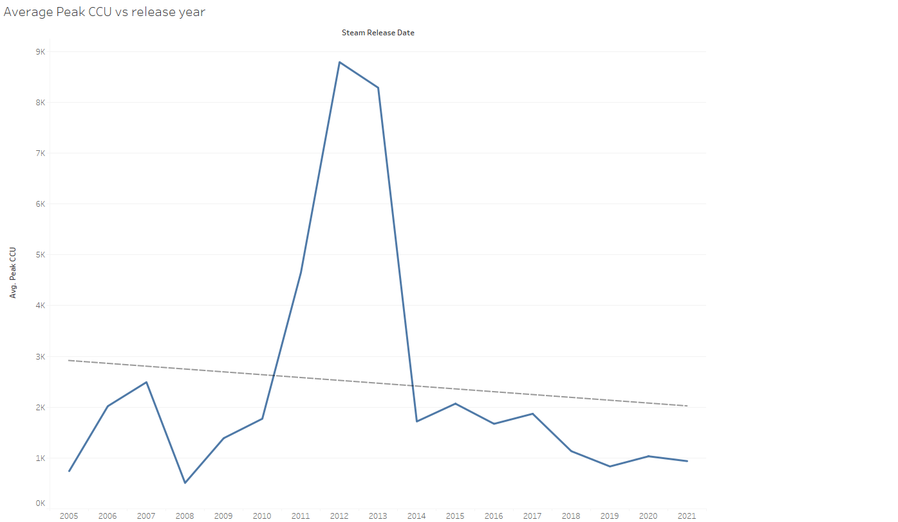

# Steam-Data-Analysis

## Introduction

Steam has been the household name for Digital PC gaming since its release. Before then it was CDs, and these were distributed by various physical shops. Today's world is different. And hand in hand with digital often comes Monopoly. And Steam is no expcetion - it has few successful competitors, and those that have been a threat to its hegemony have done so at great cost. Epic Games Store is one such, having attracted many publishers through paid timed exclusives and taking lower cuts on sales. The only other storefronts of note are Humble Bundle and GOG, both with particular niche selling points. The former sells combined packs of game and software while the latter prides itself on DRM free games.

In the face of these competitors, Steam has released various new features and programs to develop its platform. In this document, we'll be looking at the general health of Steam since its first partnership with other publishers in 2005, as well as the growth of a few of its programs: Early Access, Achievements, Cloud, Workshop, Trading Cards and more.

## Data

The data is extracted from https://www.gamedatacrunch.com/ using a python web scraping tool called selenium. Data is then processed and aggregated to provide a unified form. There is a total of around 59000 games on steam. However because so many games do not have any reviews, or very few, we only look at games that have 10 or more reviews. This brings us down considerably to 29200 games for our analysis. This means there is approximately 30000 games with less than 10 reviews. A good name for this would be the Steam No Man's Land, where games come to be unplayed and unreviewed. It is also a proof of how far Steam has come, from a Valve-only storefront for Half-Life, Counter Strike and Portal, to distributing select third party publisher only deals, and finally to hosting any third party publisher. Steam is a success story, but can it be more successful?

Note also that there is some imperfection in the data because each game represents one datapoint and as such all relevant information (number of reviews, review score, usage of steam features) is combined into one date (the release date of the game). As such if a game is released in 2013, but the crux of the reviews arrives in 2016, we will still attribute those reviews to the 2013 date of release. It is the same for other features. For example, if Steam Cloud is implemented in 2020 for a game released in 2012, this game will appear as having Steam Cloud since 2012 in our data. However, despite this effect we can still extract interesting analysis from the data.]

The data is included as part of the repository in the data file under the name top29200.csv. 

## I. Releases and Reviews

Let us begin by looking at general statistics of the games that are actually played on Steam. Firstly, let's look at the average review score since 2005 and the total number of reviews. We use the filtered reviews parameter to estimate the number of reviews, which does not take into account reviews from review bombs and gift copies. As such this approximates real reviews the most.

And let's also look at the Average Game Price (excluding Free games) coupled with the number of releases.

There is some trend in the average review score going down, and this could be because more games are being added to the store which reduces the overall quality of the selection. However, despite the overall quality going down, the price seems to trend upwards (which would be expected naturally through inflation). Though because of the noise present, it is hard to decisively state that the price is increasing. Another point of note is that the total number of reviews seems to be stagnating since 2015, which is not optimal since reviews are a driving force in game sales - more reviews increases the certainty of a game being "good" and people want to play games that are played by others. Steam must encourage user reviewing for games played. We can look at the Median Review count to further confirm that many games have very little reviews.

In recent years the increase of game releases has also created this second class of games which are not in Steam's No Man's Land, but aren't very far from it. In fact, since 2017, the Median Reviews per Game has been around 60, meaning that half of the games released in that time have less than 60 reviews (and more than 10 as explained in the data section). Considering 16000 games have been released since 2017, 8000 games have less than 60 reviews. One could say that the market is saturated, but clearly if games are being made then there is money to make these games. Gone are the days when Steam carefully selected its partners, the storefront is truly selling all kinds of games now.

However, are those unplayed games low quality? If so, we would expect a positive skewness in the Review Distribution, meaning many games would have low review scores. We show this distribution along the average price of each review score bar (the format of the price is such that 700 is 7$). 

Not only is the skewness of the distribution not positive, it is in fact negative! Most games have review scores of 50% or more, concentrated around 70 to 75%. Most games played on Steam are enjoyed by those who play it. We shouldn't forget that a binary recommend/unrecommend system will have bias introduced in it. People will often opt to recommend rather than not, especially for games that have little success. Are most games on steam good or is the review system rigged for positive reviews? I will let the reader decide.
Another point of note when looking at this review distribution is the increasing price for well reviewed games - which we would expect.

Despite these unreviewed games, are Steam's sales growing? We can use a common revenue approximation, the "Boxleiter Method". This basically multiplies the number of reviews with the price of a game (then multipled by 0.3 as Steam takes a 30% comission on sales). However, the method trades ease of use with multiple weaknesses. 

1. It doesn't take into account free games which make a lot of money from in game transactions. 
2. It also doesn't include variable pricing over a game's lifetime meaning that all sales are calculated as if the game was sold at full price.
3. Reviews are a conservative placeholder for actual number of sold games. And in fact in some cases could be an overestimation if the game sees a lot of refund requests.

However, despite this we can use the Boxleiter method to have an acceptable estimate of revenue.

Revenue has been increasing steadily over Steam's lifetime, with no slowing in sight (2021 data is not included).

On another note, we've recently heard a lot of the heavy arrival of free games and their addictive loot box mechanics. But have free games been flooding the market?

The rise has been exponential since 2013. This however is also a good thing for steam as they take a comission of F2P micro-transactions and any other DLC content.
What about blockbusters that everyone is playing? Is Steam hosting these games or have they moved to their own distribution methods (Launchers like Battle.Net)?
We can look at the average Peak Concurrent Players over the games released in a year to study the amount of blockbusters released.  

Here we can see the effect of CS:GO on 2012 and Dota 2 on 2013. If we ignore those two points, we the trend is decreasing but not dramatically so.

We've thus far looked at the general health of steam, finding that the plaftorm was generating higher revenues with a larger number of releases. However, we found that many games have little reviews, and that the reviewing system is skewed towards positive review scores.

## II. Steam features and engagement programs.

